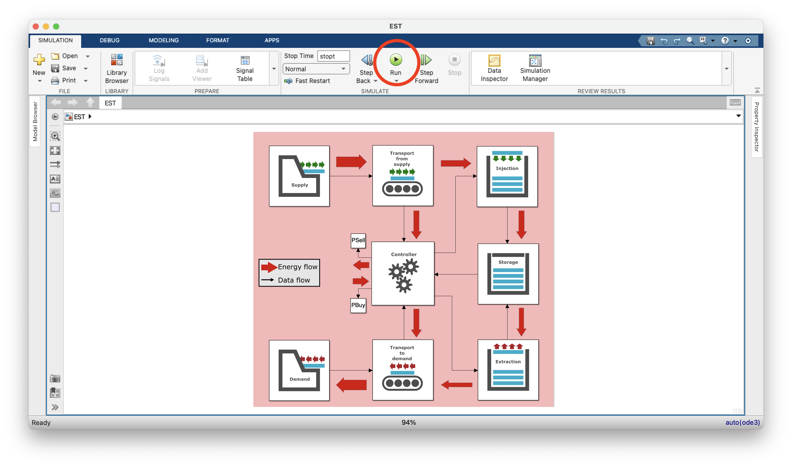
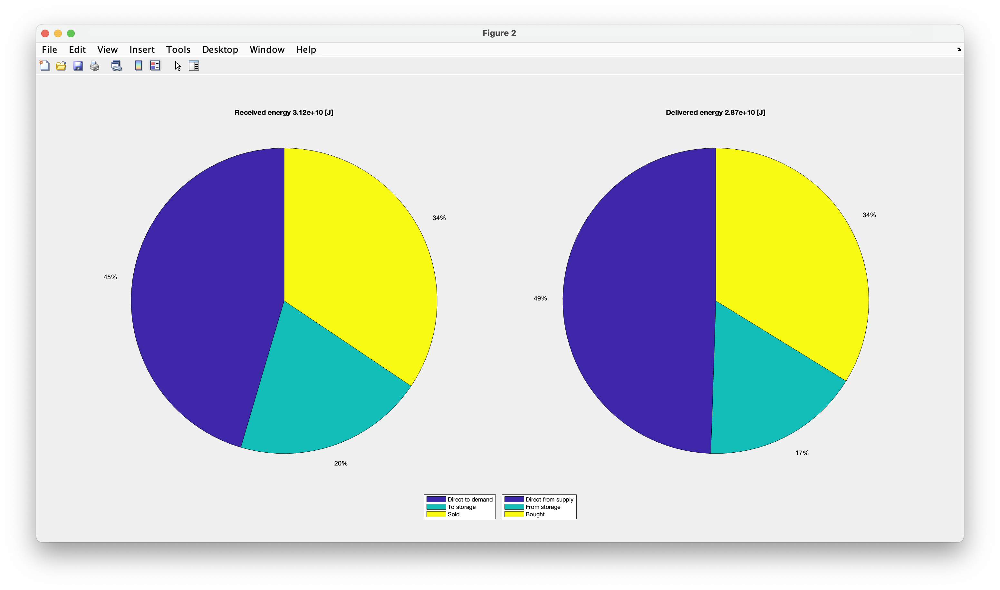
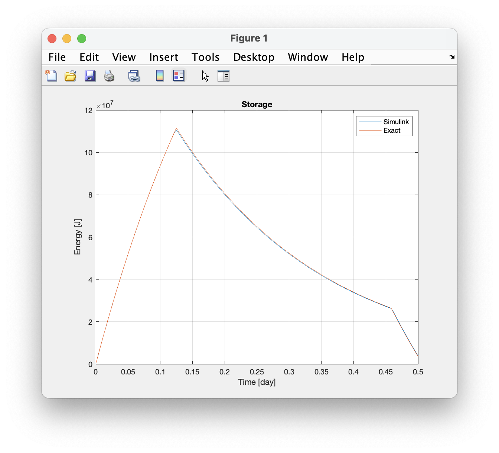

# EST-model
This project contains the *Simulink model* for the **Energy Storage and Transport (EST)** project. This Simulink model contains a simplified version of a real-life energy storage and transport system, which describes the flow of energy in such a system. Supporting MATLAB files are provided which can be used to predefine parameters and to post-process data into figures.

## Getting started
### Version requirements
The simulink model [EST.slx](EST.slx) requires **Matlab R2022b** or newer, with the **Simulink** toolbox installed. Older, untested, versions are available in the [versions](versions/) directory. In order to run an older version, copy the Simulink file corresponding to your version into the main directory and make sure to restart both MATLAB and Simulink before running it.

### Overview of files and directory structure
* [EST.slx](EST.slx): Main file, containing the runnable Simulink model of the EST system.
* [preprocessing.m](preprocessing.m): Matlab script to define the model parameters and to read the supply and demand data files. Automatically executed by the Simulink model before running.
* [postprocessing.m](postprocessing.m): Matlab script to plot the model results. Automatically executed by the Simulink model after running.
* [data directory](data/): Directory from which the supply and demand data is to be read. By default, the directory contains example files for a storage system in a household with solar panels (see [Running the model](#running-the-model)), and the files for a charge/discharge cycle (see [Charge/discharge cycle](#chargedischarge-cycle)).

## Running the model
To run the model, open [EST.slx](EST.slx) and click the run button:

After running is complete, the following output is displayed:



These results correspond to the default model settings, as configured in the [preprocessing.m](preprocessing.m) Matlab script:

```matlab
% Pre-processing script for the EST Simulink model. This script is invoked
% before the Simulink model starts running (initFcn callback function).

%% Load the supply and demand data

timeUnit   = 's';

supplyFile = "SolarExample_supply.csv";
supplyUnit = "kW";

% load the supply data
Supply = loadSupplyData(supplyFile, timeUnit, supplyUnit);

demandFile = "SolarExample_demand.csv";
demandUnit = "kW";

% load the demand data
Demand = loadDemandData(demandFile, timeUnit, demandUnit);

%% Simulation settings

deltat = 5*unit("min");
stopt  = min([Supply.Timeinfo.End, Demand.Timeinfo.End]);

%% System parameters

% transport from supply
aSupplyTransport = 0.01; % Dissipation coefficient

% injection system
aInjection = 0.1; % Dissipation coefficient

% storage system
EStorageMax     = 10.*unit("kWh"); % Maximum energy
EStorageMin     = 0.0*unit("J");   % Minimum energy
EStorageInitial = 2.0*unit("kWh"); % Initial energy
bStorage        = 1e-6/unit("s");  % Storage dissipation coefficient

% extraction system
aExtraction = 0.1; % Dissipation coefficient

% transport to demand
aDemandTransport = 0.01; % Dissipation coefficient
```

## Theory and implementation
The EST system transports energy from the `Supply` to the `Demand`, both represented by a `block` in the Simulink model, possibly storing the energy in between. The EST model consists of five components (`blocks`), in the order of the energy flow:
1. `Transport from supply`: transports the energy from the supply site to the storage site.
2. `Injection`: inserts energy into the storage container.
3. `Storage`: container in which the energy is stored.
4. `Extraction`: extracts energy from the storage container.
5. `Transport to demand`: transports the energy from the storage site to the demand site.

The flow of energy between these components is managed by a `controller`, which ensures that the electrical power balance is satisfied through load balancing (buying or selling of energy).

Each subsystem in the model can be described by

$$\dot{E}=P_{\rm in}-P_{\rm out}-D$$

where $\dot{E}$ is the change of total energy in the subsystem, $P_{\rm in}$ the incoming power, $P_{\rm out}$ the outgoing power and $D$ the rate of dissipation in the subsystem. 

For the `Transport from supply`, `Injection`, `Extraction`and `Transport to demand` components, the EST model assumes $\dot{E}=0$ and

$$D= a P_{\rm in}$$

where $a$ [-] is the subsystem dissipation coefficients. It then follows that

$$P_{\rm out} = P_{\rm in} - D = (1-a) P_{\rm in}$$

These relations are implemented in Simulink through `Matlab function blocks`, for example for the `Injection` component:

```matlab
function [PfromInjection, DInjection] = injection(PtoInjection, aInjection)
    DInjection = aInjection * PtoInjection;
    PfromInjection = PtoInjection - DInjection;
```

Note that $P_{\rm in}$ and $P_{\rm out}$ are here represented by `PtoInjection` and `PfromInjection`, respectively. The `Transport from supply` component follows the same implementation:

```matlab
function [PfromSupplyTransport, DSupplyTransport] = supplyTransport(PtoSupplyTransport, aSupplyTransport)
    DSupplyTransport = aSupplyTransport * PtoSupplyTransport;
    PfromSupplyTransport = PtoSupplyTransport - DSupplyTransport;
```

When $P_{\rm out}$ serves as the input of the system, for example for the `Extraction` component, the dissipation and power functions must be rewritten to

$$D = \frac{a}{1-a} P_{\rm out}$$

and

$$P_{\rm in} = P_{\rm out} + D = \frac{1}{1-a} P_{\rm out}$$

The implementation then follows as:

```matlab
function [PtoExtraction, DExtraction] = extraction(PfromExtraction, aExtraction)
    DExtraction = aExtraction / (1-aExtraction) * PfromExtraction;
    PtoExtraction = PfromExtraction + DExtraction;
```

Similarly, for the `Transport to demand` component, the implementation reads:

```matlab
function [PtoDemandTransport, DDemandTransport] = demandTransport(PfromDemandTransport, aDemandTransport)
    DDemandTransport = aDemandTransport / (1-aDemandTransport) * PfromDemandTransport;
    PtoDemandTransport = PfromDemandTransport + DDemandTransport;
```

For the `Storage` component, the dissipation model

$$D= b (E - E_{\rm min})$$

is assumed, where $E_{\rm min}$ is the minimum energy capacity of the system (by default set to 0) and $b$ [1/s] is the storage dissipation coefficient. This model essential states that the dissipation is proportional to the amount of energy stored.

Substitution of this dissipation model in the power balance results in the differential equation (DE)

$$\dot{E} + b E =P_{\rm in}-P_{\rm out}+b E_{\rm min}$$

In the Simulink model, this differential equation is integrated explicitly, meaning that $\dot{E}$ is computed based on the energy $E$ in the previous time step:

```matlab
function [DStorage, EdotStorage]= Storage(PtoStorage, PfromStorage, bStorage, aStorage , EStorageMin, EStorage)
    DStorage = bStorage * (EStorage-EStorageMin);
    EdotStorage = PtoStorage - PfromStorage - DStorage;
```

## Charge/discharge cycle
To illustrate the theory behind the model, we consider a single charge/discharge cycle. In this cycle, the energy system is charged for $T_{\rm charge}=3$ [h] with a power of $P_{\rm charge}=15$ [kW], after which the energy is stored for $T_{\rm store}=8$ [h], until the system is discharged for $T_{\rm discharge}=1$ [h] with a power of $P_{\rm discharge}=5$ [kW]. The corresponding supply and demand signals are stored in the [CycleExample_supply.csv](CycleExample_supply.csv) and [CycleExample_demand.csv](CycleExample_supply.csv) files. To read these files, the [preprocessing.m](preprocessing.m) file is configured as:

```matlab
% Pre-processing script for the EST Simulink model. This script is invoked
% before the Simulink model starts running (initFcn callback function).

%% Load the supply and demand data

timeUnit   = 's';

supplyFile = "CycleExample_supply.csv";
supplyUnit = "kW";

% load the supply data
Supply = loadSupplyData(supplyFile, timeUnit, supplyUnit);

demandFile = "CycleExample_demand.csv";
demandUnit = "kW";

% load the demand data
Demand = loadDemandData(demandFile, timeUnit, demandUnit);
```
The time step size, `deltat`, used in the simulation is also specified in [preprocessing.m](preprocessing.m) and the final simulation time, `stopt`, is determined from the loaded time series:
```matlab
%% Simulation settings

deltat = 5*unit("min");
stopt  = min([Supply.Timeinfo.End, Demand.Timeinfo.End]);
```
Finally, the dissipation coefficients are given by:
```matlab
%% System parameters

% transport from supply
aSupplyTransport = 0.01; % Dissipation coefficient

% injection system
aInjection = 0.1; % Dissipation coefficient

% storage system
EStorageMax     = 40*unit("kWh"); % Maximum energy
EStorageMin     = 0.0*unit("J");  % Minimum energy
EStorageInitial = 0.0*unit("J");  % Initial energy
bStorage        = 5e-5/unit('s'); % Storage dissipation coefficient

% extraction system
aExtraction = 0.1; % Dissipation coefficient

% transport to demand
aDemandTransport = 0.01; % Dissipation coefficient
```

For this particular scenario, an exact solution to the model exists, which can be used to **verify the Simulink implementation**. During charging, the power balance differential equation for the storage container reads

$$\dot{E} + b E = c P_{\rm supply}$$

where $c = (1-a_{\rm supplyTransport}) (1-a_{\rm Injection})$. With the initial condition $E(0)=0$, the solution is given by

$$E = (1 - e^{-bt}) \frac{c}{b} P_{\rm supply} \qquad 0 \leq t < T_{\rm charge}$$

During storage, the power balance reads

$$\dot{E} + b E = 0$$

with the initial condition $E(T_{\rm charge}) = (1 - e^{-bT_{\rm charge}}) \frac{c}{b} P_{\rm supply} := E_{\rm charge}$. The solution during storage is given by

$$E = E_{\rm charge} e^{-b(t - T_{\rm charge})} \qquad T_{\rm charge} \leq t \leq \tau$$

where $\tau = T_{\rm charge} + T_{\rm store}$. Finally, during discharging, the differential equation reads

$$\dot{E} + b E = -d P_{\rm demand}$$

where $d = (1-a_{\rm Extraction})^{-1}(1-a_{\rm demandTransport})^{-1}$. With the initial condition $E(\tau)=E_{\rm charge} e^{-b T_{\rm store}} := E_{\rm store}$, the solution is given by

$$E = (e^{-b(t-\tau)} -1) \frac{d}{b} P_{\rm demand} + E_{\rm store} e^{-b(t-\tau)} \qquad \tau \leq t \leq \tau + T_{\rm discharge}$$

Comparison of this exact solution with the Simulink model conveys that the model solves the model equations as intended:

